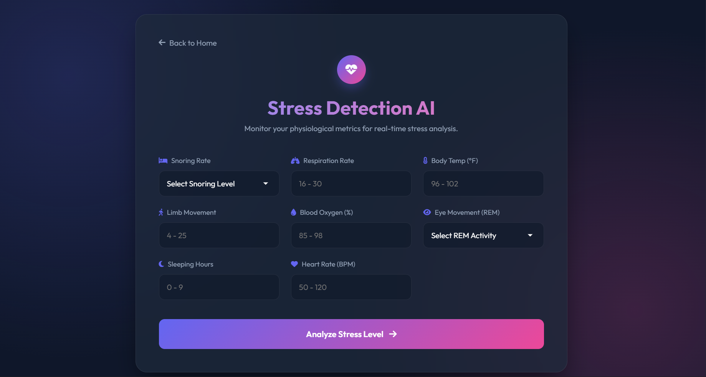

# Stress Detection AI 🧠

A Machine Learning powered web application that predicts stress levels based on physiological data. It provides real-time analysis, personalized recommendations, and finds nearby stress relief places.
## App Screenshots





## 🚀 Features

*   **ML-Powered Analysis**: Uses a Random Forest Classifier trained on physiological data (Heart rate, REM, Temperature, etc.) to predict stress levels (0-4).
*   **Modern UI**: A sleek, glassmorphism-inspired interface built with responsive HTML/CSS.
*   **Smart Recommendations**: Provides actionable advice (Sleep, Breathing exercises) if high stress is detected.
*   **Nearby Relief Spots**: Uses your location to find nearby Parks, Gardens, and Yoga centers using OpenStreetMap.
*   **Interactive Visuals**: Dynamic animations and clean data visualization.

## 🛠️ Tech Stack

*   **Backend**: Python, Flask
*   **Machine Learning**: Scikit-learn, Pandas, NumPy
*   **Frontend**: HTML5, CSS3, JavaScript (Vanilla)
*   **APIs**: OpenStreetMap (Overpass API) for location data.

## 📂 Project Structure

```
Stress Detection using ML/
│
├── app.py                # Flask application entry point
├── train_model.py        # Script to train and save the ML model
├── data_generator.py     # Script to generate synthetic training data
├── model.pkl             # Trained Random Forest Model
├── scaler.pkl            # Saved StandardScaler
├── stress_data.csv       # Synthetic dataset
│
├── static/
│   ├── style.css         # Main stylesheet
│   └── script.js         # Frontend logic (Fetch API, DOM manipulation)
│
└── templates/
    ├── index.html        # Landing Home Page
    └── analyze.html      # Analysis/Prediction Page
```

## ⚙️ Installation & Setup

1.  **Clone the repository** (or download the files).

2.  **Create a virtual environment** (recommended):
    ```bash
    python -m venv .venv
    source .venv/bin/activate  # On Windows: .venv\Scripts\activate
    ```

3.  **Install Dependencies**:
    ```bash
    pip install flask pandas numpy scikit-learn
    ```

4.  **Run the Application**:
    ```bash
    python app.py
    ```

5.  **Access the App**:
    Open your browser and navigate to `http://127.0.0.1:5000`.

## 🧠 How it Works

1.  **Input Data**: Enter physiological metrics like snoring rate, respiration, body temp, etc.
2.  **Process**: The Flask backend scales the data and feeds it into the `model.pkl`.
3.  **Result**: The app displays the stress level (Low to High).
4.  **Action**: If stress is high, it suggests specific relief actions and can locate nearby parks/yoga centers for you.

## 📝 License

This project is for educational purposes.
